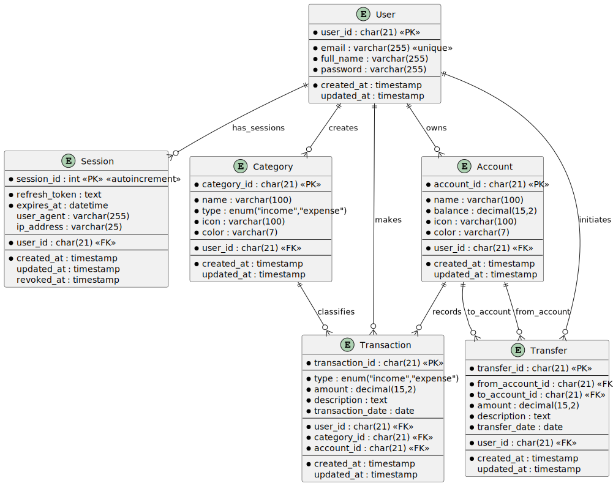

# Finance Tracker Application

Aplikasi Finance Tracker yang terdiri dari Backend API, Frontend React, dan Frontend Next.js dengan desain Neo-Brutalism yang modern dan responsive.

## 📁 Struktur Proyek

```
Tugas/
├── backend-finance-tracker/     # Backend API (Node.js + Express + TypeScript)
├── finance-tracker-react/       # Frontend React (Vite + React)
├── finance-tracker-next/        # Frontend Next.js (Next.js 15)
└── README.md                    # Dokumentasi ini
```

## 🚀 Quick Start

### 1. Backend API

```bash
cd backend-finance-tracker
npm install
npm run dev
```

Backend akan berjalan di `http://localhost:8026`

### 2. Frontend React

```bash
cd finance-tracker-react
npm install
npm run dev
```

React app akan berjalan di `http://localhost:5173`

### 3. Frontend Next.js

```bash
cd finance-tracker-next
npm install
npm run dev
```

Next.js app akan berjalan di `http://localhost:3001`

---

## 🏗️ Backend Finance Tracker

### Teknologi

- **Node.js** + **Express.js**
- **TypeScript** untuk type safety
- **Knex.js** untuk database query builder
- **JWT** untuk authentication
- **CORS** untuk cross-origin requests

### Struktur Folder

```
backend-finance-tracker/
├── src/
│   ├── app.ts                   # Main application setup
│   ├── index.ts                 # Server entry point
│   ├── configs/
│   │   └── database.ts          # Database configuration
│   ├── controllers/             # API controllers
│   │   ├── auth.controller.ts
│   │   ├── user.controller.ts
│   │   ├── account.controller.ts
│   │   ├── category.controller.ts
│   │   ├── transaction.controller.ts
│   │   ├── transfer.controller.ts
│   │   └── dashboard.controller.ts
│   ├── middlewares/
│   │   ├── auth.middleware.ts   # JWT authentication
│   │   └── error.middleware.ts  # Error handling
│   ├── models/                  # Database models
│   ├── repositories/            # Data access layer
│   ├── routes/                  # API routes
│   ├── services/                # Business logic
│   ├── types/                   # TypeScript type definitions
│   ├── utils/                   # Utility functions
│   ├── validations/             # Input validation
│   ├── migrations/              # Database migrations
│   └── seeds/                   # Database seeders
├── docs/
│   ├── swagger.json             # API documentation
│   └── financeTrackerApp.puml   # System diagram
├── package.json
├── knexfile.ts                  # Knex configuration
└── tsconfig.json
```

### API Endpoints

- **Authentication**: `/api/auth/*`
- **Users**: `/api/users/*`
- **Accounts**: `/api/accounts/*`
- **Categories**: `/api/categories/*`
- **Transactions**: `/api/transactions/*`
- **Transfers**: `/api/transfers/*`
- **Dashboard**: `/api/dashboard/*`

### Database Setup

```bash
# Run migrations
npm run migrate

# Run seeders
npm run seed
```

---

## ⚛️ Frontend React

### Teknologi

- **React 18** dengan **Vite**
- **Redux Toolkit** untuk state management
- **Tailwind CSS** untuk styling
- **Motion** untuk animasi
- **ECharts** untuk data visualization
- **Axios** untuk API calls

### Struktur Folder

```
finance-tracker-react/
├── src/
│   ├── main.jsx                 # Application entry point
│   ├── index.css                # Global styles
│   ├── components/
│   │   ├── Elements/            # Reusable UI components
│   │   │   ├── Button/
│   │   │   └── Input/
│   │   ├── Fragments/           # Complex components
│   │   │   ├── FormLogin.jsx
│   │   │   ├── FormRegister.jsx
│   │   │   ├── FormDashboard.jsx
│   │   │   └── AddTransactionSheet.jsx
│   │   └── Layouts/             # Layout components
│   │       ├── AuthLayouts.jsx
│   │       ├── PageLayout.jsx
│   │       ├── Section.jsx
│   │       ├── Sidebar.jsx
│   │       └── BottomAppBar.jsx
│   ├── Pages/                   # Page components
│   │   ├── login.jsx
│   │   ├── register.jsx
│   │   ├── dashboard.jsx
│   │   └── 404.jsx
│   ├── redux/                   # State management
│   │   ├── store.js
│   │   └── slices/
│   │       ├── authSlice.js
│   │       └── loadingSlice.js
│   ├── services/                # API services
│   │   ├── auth.service.js
│   │   └── dashboard.service.js
│   ├── hooks/                   # Custom hooks
│   │   └── useLogin.jsx
│   └── assets/                  # Static assets
│       ├── logo.svg
│       ├── logo-oikono.ico
│       └── react.svg
├── public/                      # Public assets
├── index.html                   # HTML template
├── package.json
├── vite.config.js
└── eslint.config.js
```

### Fitur

- **Authentication**: Login/Register dengan JWT
- **Dashboard**: Visualisasi data keuangan dengan chart
- **Responsive Design**: Mobile-first approach
- **Neo-Brutalism UI**: Desain yang bold dan modern
- **Real-time Updates**: Data terupdate secara real-time

---

## 🔥 Frontend Next.js

### Teknologi

- **Next.js 15** dengan **App Router**
- **React 19** dengan **Server Components**
- **Redux Toolkit** untuk state management
- **Tailwind CSS v4** untuk styling
- **shadcn/ui** untuk komponen UI
- **Motion** untuk animasi
- **ECharts** untuk data visualization
- **Axios** untuk API calls

### Struktur Folder

```
finance-tracker-next/
├── src/
│   ├── app/                     # App Router (Next.js 15)
│   │   ├── layout.js            # Root layout
│   │   ├── page.js              # Home page
│   │   ├── globals.css          # Global styles
│   │   ├── providers.js         # Redux provider
│   │   ├── login/
│   │   │   └── page.js          # Login page
│   │   ├── register/
│   │   │   └── page.js          # Register page
│   │   ├── dashboard/
│   │   │   └── page.js          # Dashboard page
│   │   └── not-found.js         # 404 page
│   ├── components/
│   │   ├── ui/                  # shadcn/ui components
│   │   │   ├── button.jsx
│   │   │   ├── input.jsx
│   │   │   ├── label.jsx
│   │   │   ├── textfield.jsx
│   │   │   ├── sheet.jsx
│   │   │   └── ClientOnly.jsx
│   │   ├── fragments/           # Complex components
│   │   │   ├── FormLogin.js
│   │   │   ├── FormRegister.js
│   │   │   ├── FormDashboard.js
│   │   │   └── AddTransactionSheet.js
│   │   └── layouts/             # Layout components
│   │       ├── AuthLayouts.js
│   │       ├── PageLayout.js
│   │       ├── Section.js
│   │       ├── Sidebar.js
│   │       └── BottomAppBar.js
│   ├── redux/                   # State management
│   │   ├── store.js
│   │   └── slices/
│   │       ├── authSlice.js
│   │       └── loadingSlice.js
│   ├── services/                # API services
│   │   ├── auth.service.js
│   │   ├── dashboard.service.js
│   │   ├── account.service.js
│   │   └── category.service.js
│   └── lib/
│       └── utils.js             # Utility functions
├── public/                      # Public assets
│   ├── logo-oikono.ico
│   └── *.svg
├── package.json
├── next.config.mjs
├── postcss.config.mjs
├── jsconfig.json
└── components.json              # shadcn/ui config
```

### Fitur

- **Server-Side Rendering**: SEO-friendly
- **App Router**: Routing modern Next.js 15
- **Hydration Safety**: Mencegah hydration errors
- **Responsive Design**: Mobile-first approach
- **Neo-Brutalism UI**: Desain yang bold dan modern
- **shadcn/ui Integration**: Komponen UI yang konsisten

---

## 📚 API Documentation

### Swagger UI Documentation

API documentation lengkap dapat diakses melalui Swagger UI di:
**http://localhost:8026/api/api-docs**


### Database Schema (ERD)

Berikut adalah Entity Relationship Diagram (ERD) untuk database Finance Tracker:


